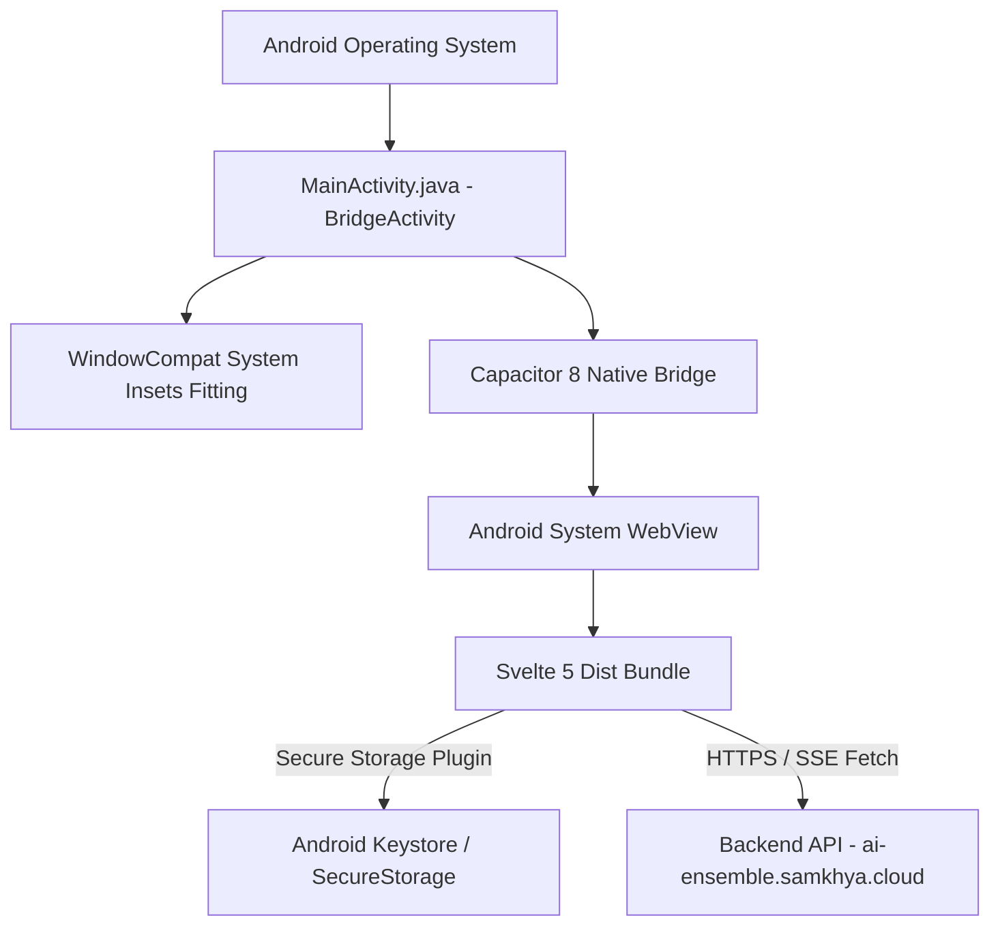

# Specification: Native Android Application

# Purpose
The Android subsystem provides a cross-platform native mobile application wrapper built with Capacitor 8 and Gradle. It exposes the AI-Ensemble platform on Android devices with native secure credential storage, hardware inset integration, and full feature parity with the web application.

# Responsibilities
- Render the responsive Svelte 5 web interface inside a native Android `BridgeActivity` WebView.
- Configure Android system window insets (`WindowCompat.setDecorFitsSystemWindows(true)`) to prevent status bar, camera notch, and gesture bar cutoff.
- Store sensitive JWT access/refresh tokens in the Android Keystore via Capacitor Secure Storage (`@aparajita/capacitor-secure-storage`).
- Automatically resolve the public production API base URL (`https://ai-ensemble.samkhya.cloud`) for outbound native network requests.
- Package debug and release APK binaries via Gradle.

# Architecture

# Data Flow
1. Android OS launches `cloud.aiensemble.app.MainActivity`.
2. `MainActivity.onCreate()` configures `WindowCompat.setDecorFitsSystemWindows(getWindow(), true)` to fit system bars.
3. Capacitor Bridge loads local web assets from `android_asset/public/index.html`.
4. `frontend/src/lib/api/client.ts` detects native Capacitor execution (`win.Capacitor?.isNativePlatform()`) and resolves `getBaseUrl()` to `https://ai-ensemble.samkhya.cloud`.
5. Authentication tokens are saved to Android Keystore via `@aparajita/capacitor-secure-storage`.

# Internal Components
- `frontend/android/app/src/main/java/cloud/aiensemble/app/MainActivity.java`: Extends `BridgeActivity`. Configures window decor and status bar appearance.
- `frontend/android/app/build.gradle`: Android application build configuration, SDK versions (`compileSdk 35`, `minSdk 23`, `targetSdk 35`), dependencies, and signing configs.
- `frontend/capacitor.config.ts`: Capacitor project configuration (`appId: "cloud.aiensemble.app"`, `appName: "AI-Ensemble"`, `webDir: "dist"`).
- `frontend/src/lib/stores/auth.svelte.ts`: Handles native secure storage token reading/writing on Capacitor.

# Public Interfaces
- Native Application Package ID: `cloud.aiensemble.app`.
- Compiled Binary: `frontend/android/app/build/outputs/apk/debug/app-debug.apk`.

# Dependencies
- Android SDK 35, JDK 17 / JDK 21, Gradle 8.14.3, Capacitor CLI `8.4.2`, Capacitor Android `8.4.2`, `@aparajita/capacitor-secure-storage` `8.0.0`.

# Configuration
- `frontend/capacitor.config.ts`: Capacitor configuration.
- `frontend/android/variables.gradle`: Version numbers and SDK definitions.

# Current Behaviour
The Android app compiles cleanly via `./gradlew assembleDebug`. It connects directly to the production backend (`https://ai-ensemble.samkhya.cloud`), supports zero-knowledge session mapping, auto-minimizes the chat composer during model streaming, and fits cleanly inside Android screen boundaries.

# Constraints
- Building the APK requires JDK 17 or JDK 21 installed on the build machine.
- Tailscale file transfer (`tailscale file cp`) requires the target Android device to be awake and connected to the Tailnet.

# Future Considerations
- Push notifications via Firebase Cloud Messaging (FCM) for completed deep research background runs.
- Android biometrics (Fingerprint / Face Unlock) to unlock the User Encryption Key (UEK).

# Related Specs
- [Architecture Spec](architecture.md)
- [Frontend Spec](frontend.md)
- [Authentication Spec](authentication.md)
