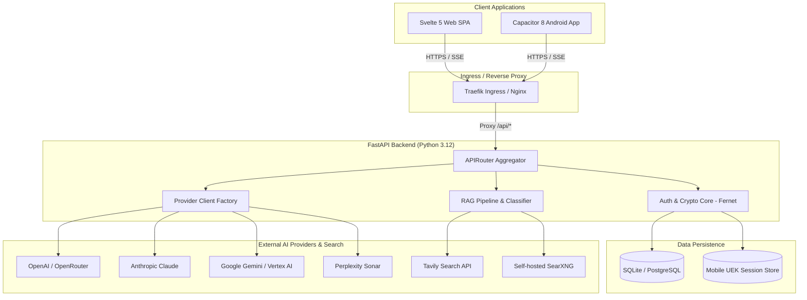
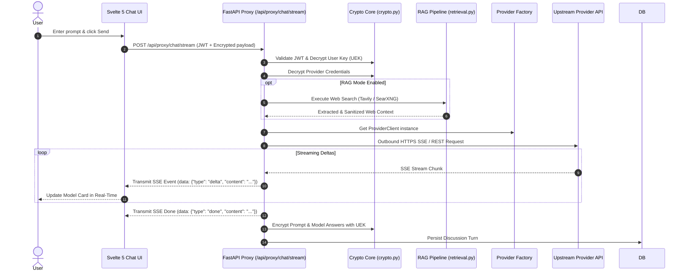

# Specification: End-to-End System Architecture

# Purpose
This document specifies the end-to-end technical architecture, component topologies, runtime execution flows, data models, and security boundaries of AI-Ensemble.

# Responsibilities
- Define component relationships between Web/Android clients, FastAPI backend, databases, and AI providers.
- Document request lifecycles for authentication, proxy chat streaming, RAG enrichment, and consensus generation.
- Specify zero-knowledge envelope encryption protocols and key management workflows.
- Detail deployment topologies across Docker Compose and Kubernetes (k3s).

# Architecture

# Data Flow

### AI Chat Request & SSE Streaming Lifecycle

# Internal Components
- **FastAPI Core (`backend/app/main.py`)**: Web application instance, CORS middleware, exception handlers, and rate limiters.
- **Crypto Engine (`backend/app/core/crypto.py`)**: PBKDF2 key derivation (600K iterations) and AES-256-Fernet cipher management.
- **Session Store (`backend/app/core/sessions.py`)**: In-memory and DB-backed mapping of mobile session IDs (`sid`) to decrypted UEKs.
- **Provider Clients (`backend/app/services/providers/`)**: Concrete implementations for OpenAI, Anthropic, Gemini, Vertex, and Perplexity.
- **Svelte Store (`frontend/src/lib/stores/discussion.svelte.ts`)**: Class-based reactive state store managing turn rounds, SSE events, and model selections.

# Public Interfaces
- REST API Base: `/api`
- Key Routes: `/api/auth/*`, `/api/providers/*`, `/api/discussions/*`, `/api/folders/*`, `/api/proxy/*`, `/api/admin/*`.

# Dependencies
- Python 3.12, FastAPI, SQLAlchemy 2.0, Alembic, Pydantic v2, PyJWT, Cryptography (Fernet), Trafilatura.
- Node.js 22, Svelte 5, Vite 6, TypeScript 5, Capacitor 8.

# Configuration
- Managed via `backend/app/core/config.py` using `pydantic-settings`.
- Required settings: `JWT_SECRET`, `CREDENTIAL_ENCRYPTION_KEY`, `DATABASE_URL`.

# Current Behaviour
The backend runs asynchronously under Uvicorn. Upon receiving a chat request, credentials and prompts are decrypted on the fly using the user's UEK, forwarded to the upstream LLM via SSE streams, and re-encrypted before being committed to the database.

# Constraints
- High-concurrency SSE streaming requires asynchronous HTTP clients (`httpx`).
- Network requests to upstream providers are subject to user-configured timeouts (default 120s).

# Future Considerations
- Horizontal scaling with distributed Redis session stores and WebSockets for bi-directional streaming.

# Related Specs
- [Overview Spec](overview.md)
- [Backend Spec](backend.md)
- [Frontend Spec](frontend.md)
- [Security Spec](security.md)
