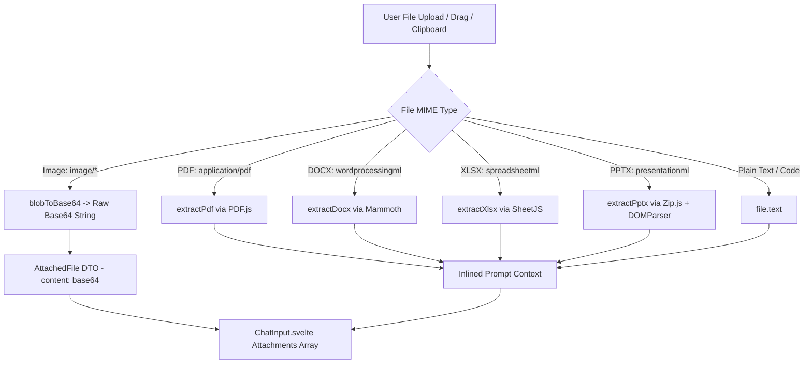

# Specification: Attachments & Document Processing

# Purpose
The Attachments subsystem handles file uploads, multimodal image base64 encoding, document text extraction (PDF, DOCX, XLSX, PPTX, RTF, TXT), vision model capability warnings, and thumbnail rendering.

# Responsibilities
- Process user file attachments via file picker, drag-and-drop, or clipboard paste.
- Extract raw text from complex document formats (`PDF.js`, `Mammoth`, `XLSX`, `Zip.js`).
- Base64-encode image files for multimodal vision model prompts (`GPT-4o`, `Gemini 1.5/2.0`, `Claude 3.5`).
- Enforce 100 MB maximum file size limit per upload.
- Display inline image thumbnails and document chips in `ChatInput.svelte` and `ChatMessages.svelte`.

# Architecture

# Supported Document MIME Types (`extractDocument.ts`)

| Format | Library / Tool | Extraction Strategy |
| :--- | :--- | :--- |
| **PDF** | `pdfjs-dist` | Iterates page text contents and joins page strings |
| **DOCX** | `mammoth` | Extracts raw document text |
| **XLSX / XLS** | `xlsx` (SheetJS) | Converts sheet data into structured CSV blocks |
| **PPTX** | `@zip.js/zip.js` | Parses XML slide entries (`ppt/slides/slide*.xml`) and extracts `<a:t>` text nodes |
| **RTF / ODF** | DOMParser / Regex | Strips RTF control codes or parses XML paragraph nodes (`text:p`) |

# Data Flow
1. User drops file onto `ChatInput.svelte`.
2. `handleFiles()` checks `file.size <= 100MB`.
3. If image, converts to base64. If document, invokes `extractDocumentText(file)`.
4. Attachment object `{ name, size, type, content }` is stored in `attachments` array.
5. On send, text files are appended as formatted prompt text (`--- Attached: file.txt ---`), while image base64 strings are transmitted in the `attachments` array for vision model parsing.

# Internal Components
- `extractDocument.ts`: Client-side text extraction engine for documents.
- `ChatInput.svelte`: Upload handler and attachment chip rendering.
- `ChatMessages.svelte`: Rendered user turn attachment preview thumbnails.

# Public Interfaces
- Function: `extractDocumentText(file: File): Promise<string | null>`
- Interface: `AttachedFile { name: string; size: number; type: string; content: string }`

# Dependencies
- `pdfjs-dist`, `mammoth`, `xlsx`, `@zip.js/zip.js`, `dompurify`.

# Configuration
- Max File Size: `100 * 1024 * 1024` (100 MB).

# Current Behaviour
Users can attach documents or images. Document text is extracted locally inside the browser/app without sending raw files to external conversion servers.

# Constraints
- Large PDF/PPTX parsing runs on the main thread and may take 1–2 seconds for 100+ page documents.

# Future Considerations
- Web Worker offloading for document extraction to keep the UI thread 100% smooth.

# Related Specs
- [Prompt Composer Spec](prompt-composer.md)
- [Chat Spec](chat.md)
