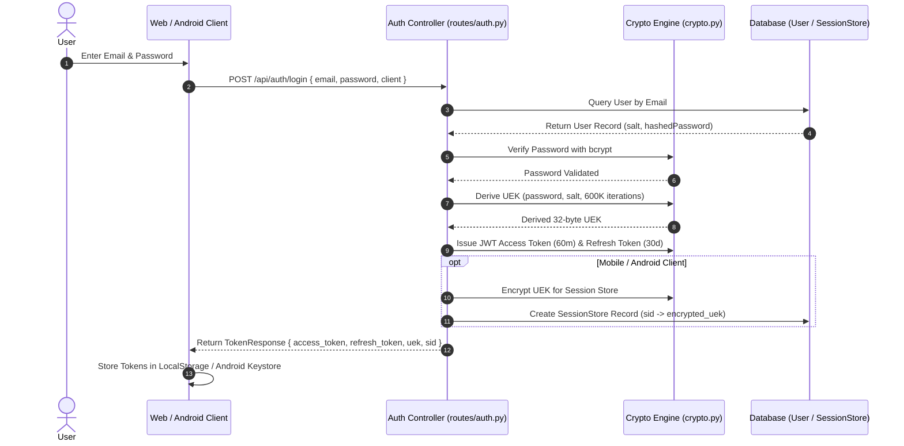

# Specification: Authentication & Key Derivation

# Purpose
The Authentication subsystem handles user registration, login, JWT access/refresh token generation, refresh token rotation, zero-knowledge User Encryption Key (UEK) derivation, and mobile session persistence.

# Responsibilities
- Hash user account passwords securely using `bcrypt`.
- Derive a 32-byte User Encryption Key (UEK) using PBKDF2-HMAC-SHA256 (600,000 iterations).
- Issue short-lived JWT access tokens (60 mins) and long-lived refresh tokens (30 days).
- Support refresh token rotation and revocation (`RefreshToken` ORM model).
- Maintain a server-side `SessionStore` mapping opaque session IDs (`sid`) to decrypted UEKs for mobile Android clients.

# Architecture

# Token Specifications
- **Access Token**: HS256 JWT, expires in 60 minutes. Contains `sub` (email), `is_admin`, and `type: "access"`.
- **Refresh Token**: HS256 JWT, expires in 30 days. Contains `sub` (email), `jti` (unique UUID), and `type: "refresh"`.
- **UEK (User Encryption Key)**: 32-byte URL-safe base64 string derived via `PBKDF2HMAC(SHA256, length=32, salt, iterations=600000)`.

# Data Flow
1. User logs in at `LoginPage.svelte`.
2. `api.login()` calls `POST /api/auth/login`.
3. Response tokens are saved to browser `localStorage` or native Android Keystore via `@aparajita/capacitor-secure-storage`.
4. Subsequent API calls attach `Authorization: Bearer <access_token>` and `X-Session-ID: <sid>`.

# Internal Components
- `app/api/routes/auth.py`: Registration, login, refresh, and logout controllers.
- `app/core/security.py`: Password verification & JWT creation/decoding functions.
- `app/core/crypto.py`: `generate_uek()`, `encrypt_uek()`, `decrypt_uek()`.
- `app/core/sessions.py`: `SessionStore` model and session lookup cache.

# Public Interfaces
- REST Endpoints:
  - `POST /api/auth/register`
  - `POST /api/auth/login`
  - `POST /api/auth/refresh`
  - `POST /api/auth/logout`

# Dependencies
- `passlib[bcrypt]`, `python-jose`, `cryptography`, `auth.svelte.ts`.

# Configuration
- Iterations: `600_000` (OWASP standard).
- Token Expirations: `access_token_expire_minutes = 60`, `refresh_token_expire_days = 30`.

# Current Behaviour
Users authenticate via email and password. Upon password migration, legacy unencrypted user records are re-encrypted automatically with the new UEK.

# Constraints
- Changing password requires re-encrypting all stored provider keys and discussion records with the new UEK.

# Future Considerations
- WebAuthn / Passkey support integrated into UEK derivation.

# Related Specs
- [Backend Spec](backend.md)
- [Authorization Spec](authorization.md)
- [Security Spec](security.md)
