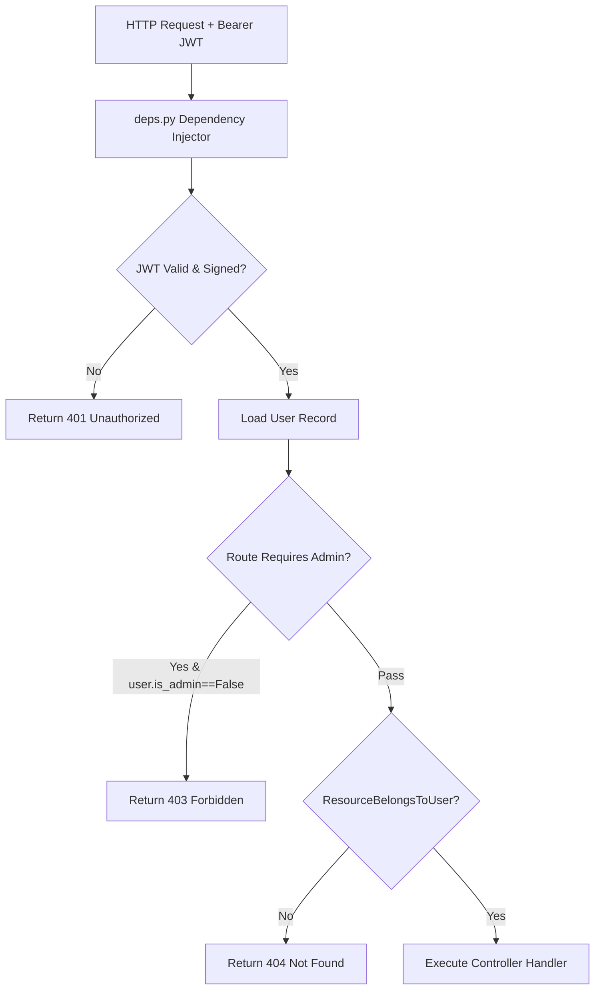

# Specification: Authorization & Access Control

# Purpose
The Authorization subsystem specifies Role-Based Access Control (RBAC), resource ownership isolation, admin privileges, dependency injection guards, and permission checks.

# Responsibilities
- Restrict discussion, folder, and provider credential access strictly to the owner user (`user_id`).
- Guard administrative API routes (`/api/admin/*`) requiring `is_admin == True`.
- Protect against unauthorized cross-tenant data access.
- Validate Bearer JWT signatures and handle token revocation.

# Architecture

# Access Control Matrix

| Endpoint Route | Unauthenticated | Standard User | Admin User |
| :--- | :--- | :--- | :--- |
| `POST /api/auth/register`, `/login`, `/refresh` | Allowed | Allowed | Allowed |
| `GET /api/discussions/*` | Denied (401) | Owner Only | Owner Only |
| `GET /api/providers/*` | Denied (401) | Owner Only | Owner Only |
| `GET /api/folders/*` | Denied (401) | Owner Only | Owner Only |
| `POST /api/proxy/chat/stream` | Denied (401) | Allowed (Using Owner Keys) | Allowed |
| `GET /api/admin/users` | Denied (401) | Denied (403) | Allowed |
| `DELETE /api/admin/users/{id}` | Denied (401) | Denied (403) | Allowed |

# Data Flow
1. FastAPI dependency `get_current_user` in `app/api/deps.py` runs on protected endpoints.
2. Extracts Bearer token, decodes JWT with `jwt_secret`, and verifies `type == "access"`.
3. Checks user active status in database.
4. Dependency `get_admin_user` additionally asserts `user.is_admin is True`.

# Internal Components
- `app/api/deps.py`: `get_current_user`, `get_admin_user`, `get_current_uek`.
- `app/api/routes/admin.py`: Restricted administration controller.

# Public Interfaces
- Dependency Injectors:
  - `CurrentUser = Annotated[User, Depends(get_current_user)]`
  - `AdminUser = Annotated[User, Depends(get_admin_user)]`

# Dependencies
- `python-jose`, `FastAPI Depends`.

# Configuration
- Admin Flag: `User.is_admin` boolean column in database.

# Current Behaviour
Users can only read, update, or delete resources they created. Attempting to query another user's discussion ID returns a `404 Not Found` (preventing ID enumeration).

# Constraints
- Admin users cannot view another user's encrypted prompts because the prompt ciphertext can only be decrypted with the owner's UEK.

# Future Considerations
- Team/Organization multi-tenancy with shared workspace folders.

# Related Specs
- [Authentication Spec](authentication.md)
- [Users Spec](users.md)
