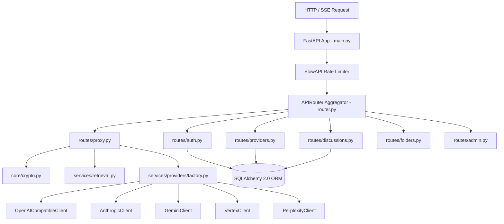

# Specification: Backend Service Architecture

# Purpose
The backend subsystem provides an asynchronous REST and Server-Sent Events (SSE) web API built with FastAPI and Python 3.12. It handles authentication, zero-knowledge envelope encryption, provider proxying, RAG context retrieval, database persistence, and rate limiting.

# Responsibilities
- Serve secure REST endpoints for user accounts, provider credentials, discussions, folders, and admin operations.
- Proxy and stream completion requests to 10+ upstream AI provider REST/SSE APIs.
- Derive User Encryption Keys (UEK) using PBKDF2-HMAC-SHA256 and encrypt all sensitive payload fields at rest with AES-256-Fernet.
- Execute real-time web context retrieval and Trafilatura content extraction.
- Enforce IP and route-level rate limits via SlowAPI.

# Architecture

# Data Flow
1. Incoming HTTP requests pass through SlowAPI rate limiting and CORS middleware.
2. `app/api/deps.py` extracts Bearer JWT token, validates user, and retrieves/resolves transient UEK or mobile session (`sid`).
3. Endpoint controller executes business logic, invoking `core/crypto.py` for field decryption/encryption.
4. For proxy chat, `services/providers/factory.py` instantiates the appropriate provider client and streams SSE chunks back to the client via `StreamingResponse`.

# Internal Components
- `app/main.py`: Application entrypoint, lifespan startup database initialization, CORS, exception handlers.
- `app/core/crypto.py`: Envelope encryption module (`Fernet`, `PBKDF2HMAC`, `generate_uek`).
- `app/core/security.py`: Password hashing via `bcrypt` and JWT token creation/decoding (`python-jose`).
- `app/core/url_safety.py`: SSRF protection validator checking target IPs against private/loopback ranges.
- `app/services/providers/base.py`: Abstract base class `ProviderClient` enforcing `list_models`, `chat`, and `chat_stream`.
- `app/services/retrieval.py`: Asynchronous web search manager querying Tavily, SearXNG, DuckDuckGo, and executing Trafilatura content extraction.

# Public Interfaces
- FastAPI application running on port 8080.
- OpenAPI specification auto-generated at `/docs` or `/openapi.json`.

# Dependencies
- Python 3.12, FastAPI `0.116.1`, Uvicorn `0.34.3`, SQLAlchemy `2.0.41`, Alembic `1.16.2`, Pydantic `2.11.7`, `cryptography` `45.0.5`, `httpx` `0.28.1`, `trafilatura` `1.10.0`, `slowapi` `0.1.9`.

# Configuration
- Configured via `app/core/config.py` using `pydantic-settings`.
- Environment variables loaded from `.env`.

# Current Behaviour
The backend runs as an async ASGI service. All database models are created at startup if missing (`init_db()`), and Alembic migrations manage schema updates.

# Constraints
- Blocking synchronous operations (like Trafilatura HTML parsing) must be wrapped in `asyncio.to_thread`.
- Database connections use connection pooling suited for SQLite or PostgreSQL.

# Future Considerations
- Async Redis background job queues (Celery/ARQ) for long-running deep research queries.

# Related Specs
- [Architecture Spec](architecture.md)
- [Authentication Spec](authentication.md)
- [Providers Spec](providers.md)
- [Database Spec](database.md)
