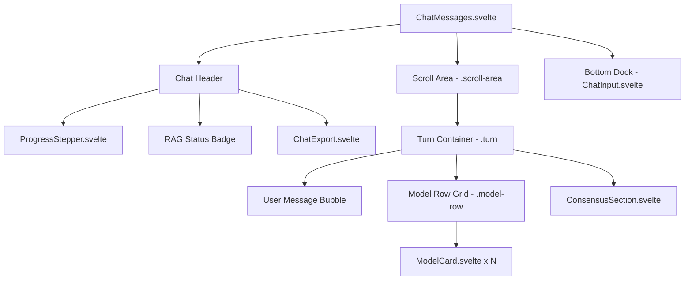

# Specification: Chat View & Discussion Thread

# Purpose
The Chat subsystem renders multi-turn, multi-model AI conversations, displaying user messages, side-by-side model outputs, streaming progress indicators, RAG context badges, and consensus synthesis cards.

# Responsibilities
- Render round-by-round discussion turns (`turn` 1, 2, 3...).
- Display user message prompts with inline multimodal file and image attachments.
- Render model response cards in a responsive side-by-side grid (`ModelCard.svelte`).
- Render consensus synthesis cards (`ConsensusSection.svelte`) generated by the selected consensus model.
- Show live execution progress steppers, round indicators, and RAG retrieval status badges.
- Provide a floating "Jump to Latest" scroll button when user scrolls up during active streaming.

# Architecture

# Data Flow
1. `ChatMessages.svelte` listens to reactive state in `discussion.data` store.
2. Turns are iterated by round numbers (`roundNums = [1, 2, 3]`).
3. For each round, `Object.entries(discussion.data.rounds[rn])` renders individual model cards.
4. If `atBottom` is false during streaming, `showJump` renders the floating "Jump to Latest" button.

# Internal Components
- `ChatMessages.svelte`: Parent conversation container managing scroll position and turns.
- `ModelCard.svelte`: Individual model response card rendering markdown text, status badges, response time, token count, copy button, and retry/skip actions.
- `ConsensusSection.svelte`: Specialized synthesis card highlighting consensus agreement points and model disagreements.
- `ProgressStepper.svelte`: Step indicator showing real-time phase ("searching", "routing", "streaming", "consensus").

# Public Interfaces
- Component: `<ChatMessages onEditModels={() => void} />`

# Dependencies
- `discussion.svelte.ts` (store containing `data.rounds`, `data.userMessages`, `data.retrieved_context`, `running`, `phase`).
- `Marked` + `DOMPurify` (safe markdown and HTML rendering).

# Configuration
- Scroll sensitivity threshold: `gap < 80px` sets `atBottom = true`.
- Model grid column width: `grid-template-columns: repeat(auto-fit, minmax(280px, 1fr))`.

# Current Behaviour
When a discussion is active, user messages appear in grey bubbles, model answers stream into side-by-side cards with live shimmer skeletons, and consensus summaries render in orange-bordered cards at the bottom of each turn.

# Constraints
- On mobile screens, 3+ models wrap vertically into multi-row cards.

# Future Considerations
- Horizontal column scroll toggle mode for side-by-side 4+ model comparisons.

# Related Specs
- [Frontend Spec](frontend.md)
- [Ensemble Spec](ensemble.md)
- [Streaming Spec](streaming.md)
