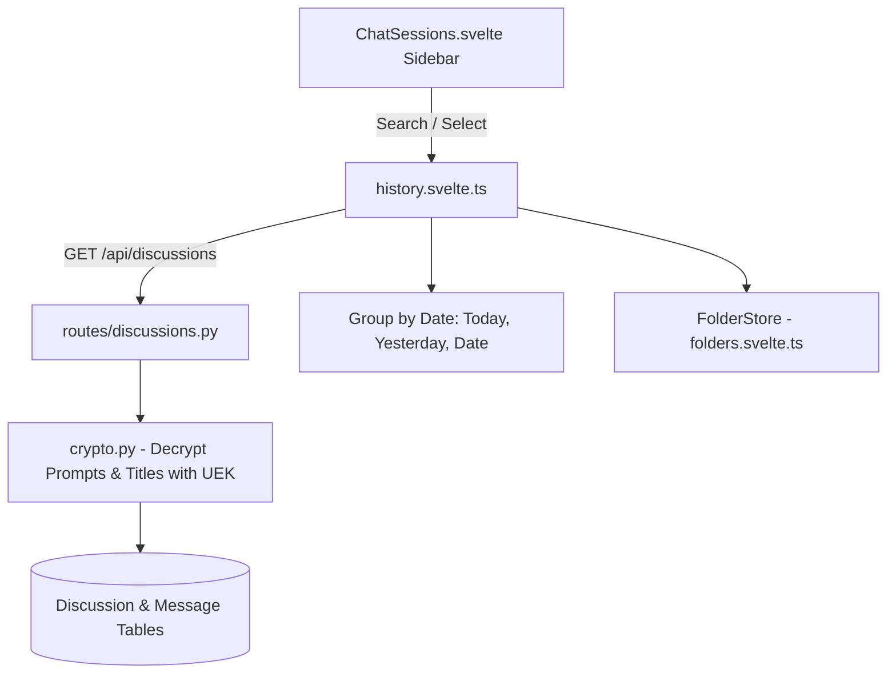

# Specification: Conversations & History Management

# Purpose
The Conversations subsystem specifies discussion creation, loading, update, deletion, turn history persistence, folder organization, date-based session grouping, and transcript export.

# Responsibilities
- Manage `Discussion` and `Message` database entities with zero-knowledge UEK envelope encryption.
- Provide discussion search, filter by completion status, and date-grouping ("Today", "Yesterday", historical dates).
- Organize discussions into hierarchical custom folders (`Folder` and `folder_discussions` ORM models).
- Format and export complete chat transcripts in Markdown, Plaintext, HTML, or PDF print layouts.

# Architecture

# Data Flow
1. On app initialization, `history.load()` fetches all user discussions via `GET /api/discussions`.
2. Backend loads encrypted discussion records, decrypts titles and questions using the user's UEK, and returns JSON DTOs.
3. `ChatSessions.svelte` filters out discussions assigned to folders and groups remaining items under date headings.
4. User clicking a session loads its full state into `discussion.load(state)`.

# Internal Components
- `app/api/routes/discussions.py`: Discussion CRUD and research trigger routes.
- `app/api/routes/folders.py`: Folder management endpoints.
- `history.svelte.ts`: Svelte 5 store managing session search and sorting.
- `folders.svelte.ts`: Svelte 5 store managing folder trees and discussion assignments.
- `ChatExport.svelte`: Transcript export component generating Markdown, TXT, HTML, or opening browser print dialog.

# Public Interfaces
- REST Endpoints:
  - `GET /api/discussions`
  - `POST /api/discussions`
  - `GET /api/discussions/{id}`
  - `PUT /api/discussions/{id}`
  - `DELETE /api/discussions/{id}`
  - `GET /api/folders`
  - `POST /api/folders`

# Dependencies
- `SQLAlchemy 2.0`, `crypto.py`, `history.svelte.ts`, `folders.svelte.ts`.

# Configuration
- Transcript export formats: `"markdown"`, `"txt"`, `"html"`, `"print"`.

# Current Behaviour
Discussions are listed chronologically in the left sidebar. Users can search by keyword, drag/move items into custom folders, or delete unwanted sessions.

# Constraints
- Decrypting history requires a valid active session with access to the user's UEK.

# Future Considerations
- Full-text search index across encrypted message contents using client-side vector search.

# Related Specs
- [Backend Spec](backend.md)
- [Database Spec](database.md)
- [Storage Spec](storage.md)
