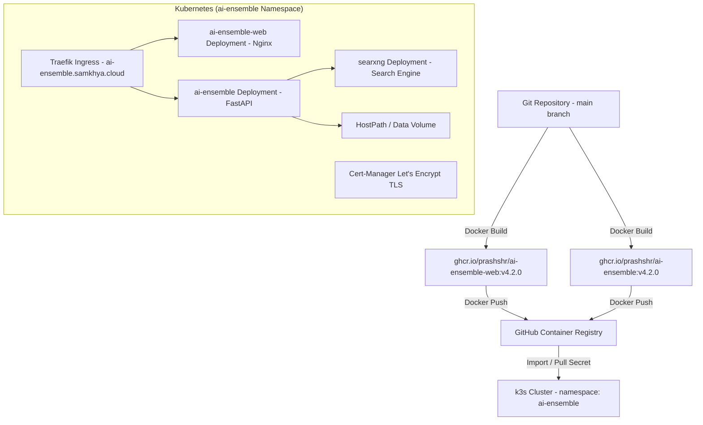

# Specification: Deployment Architecture & Kubernetes Infrastructure

# Purpose
The Deployment subsystem specifies Docker containerization, multi-stage image builds, GitHub Container Registry (GHCR) publishing, Docker Compose orchestration, and Kubernetes (k3s) manifest deployment under namespace `ai-ensemble`.

# Responsibilities
- Package FastAPI backend into non-root Python 3.12 Docker container image (`ghcr.io/prashshr/ai-ensemble`).
- Package Svelte 5 frontend into security-hardened Nginx 1.27 Alpine Docker container image (`ghcr.io/prashshr/ai-ensemble-web`).
- Manage Kubernetes resources (`namespace`, `deployment`, `service`, `configmap`, `secret`, `ingress`, `cert-manager`).
- Deploy self-hosted SearXNG instance (`searxng-deployment.yaml`) for private web search.
- Provide automated deployment scripts (`deploy/k8s/apply.sh`, `scripts/deploy-prod.sh`).

# Architecture

# Kubernetes Manifests (`deploy/k8s/`)

| File | Resource Type | Name | Purpose |
| :--- | :--- | :--- | :--- |
| `namespace.yaml` | Namespace | `ai-ensemble` | Isolated Kubernetes namespace |
| `deployment.yaml` | Deployment | `ai-ensemble` | Backend FastAPI pod (`ghcr.io/prashshr/ai-ensemble:v4.2.0`) |
| `service.yaml` | Service | `ai-ensemble` | ClusterIP service on port 8080 |
| `web-deployment.yaml` | Deployment | `ai-ensemble-web` | Frontend Nginx pod (`ghcr.io/prashshr/ai-ensemble-web:v4.2.0`) |
| `web-service.yaml` | Service | `ai-ensemble-web` | ClusterIP service on port 80 |
| `web-nginx-configmap.yaml` | ConfigMap | `ai-ensemble-web-nginx` | Nginx reverse proxy configuration |
| `searxng-deployment.yaml` | Deployment | `searxng` | Self-hosted SearXNG search engine instance |
| `ingress.yaml` | Ingress | `ai-ensemble` | Traefik ingress routing `https://ai-ensemble.samkhya.cloud` |
| `cert.yaml` | Certificate | `ai-ensemble-cert` | cert-manager Let's Encrypt TLS certificate |

# Data Flow
1. Developer pushes code to `main` branch and creates version tag (e.g. `v4.2.0`).
2. Docker images are built and pushed to GHCR (`ghcr.io/prashshr/ai-ensemble-web:v4.2.0` and `ghcr.io/prashshr/ai-ensemble:v4.2.0`).
3. Running `bash deploy/k8s/apply.sh` applies manifests and triggers `kubectl rollout restart`.

# Internal Components
- `backend/Dockerfile`: Non-root Python 3.12 container (`appuser`, UID 1000).
- `frontend/Dockerfile`: Multi-stage build (`node:22-alpine` -> `nginx:1.27-alpine`).
- `deploy/k8s/apply.sh`: Kubernetes deployment script.

# Public Interfaces
- Live Application URL: `https://ai-ensemble.samkhya.cloud`

# Dependencies
- Kubernetes (k3s), Docker, Traefik Ingress, cert-manager, GHCR.

# Configuration
- `GHCR_PAT`: GitHub Personal Access Token for GHCR image pull secret.

# Current Behaviour
The live application runs under namespace `ai-ensemble` on k3s. Both backend and frontend deployments are running `v4.2.0` images.

# Constraints
- Backend container runs as non-root user `appuser` (UID 1000) for security compliance.

# Future Considerations
- Automated GitHub Actions CI/CD workflow to build, test, tag, and deploy automatically on git tag push.

# Related Specs
- [Architecture Spec](architecture.md)
- [Backend Spec](backend.md)
- [Security Spec](security.md)
