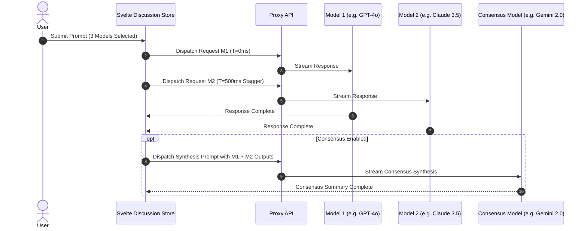

# Specification: Multi-Model Ensemble & Consensus Engine

# Purpose
The Ensemble subsystem specifies the orchestration of multi-model AI discussions, staggered concurrent request dispatches, multi-round follow-up turns, and automated consensus synthesis generation.

# Responsibilities
- Dispatch multi-model chat requests concurrently with staggering (`MAX_CONCURRENT = 3`, `STAGGER_MS = 500`).
- Orchestrate multi-round discussion passes (1, 2, or 3 rounds) where follow-up rounds build upon prior model responses.
- Synthesize all model outputs into a unified consensus summary using a designated consensus model.
- Support "Stop" and "Stop & Summarize" execution commands during active streaming.

# Architecture

# Data Flow
1. User clicks Send in `ChatInput.svelte`.
2. `discussion.svelte.ts` initializes round 1 in `discussion.data.rounds[1]`.
3. Selected models are queued. Store loops through model keys, dispatching stream requests with 500ms staggering.
4. When all model answers in the round complete, if `consensusEnabled` is true, a synthesis prompt containing all model replies is dispatched to `consensusModel`.
5. On completion, the entire turn state is saved to the backend database via `api.createDiscussion()` or `api.updateDiscussion()`.

# Internal Components
- `discussion.svelte.ts`: Svelte 5 Runes store managing turn state, staggered dispatch loop, and consensus synthesis.
- `ConsensusSection.svelte`: UI card component displaying the consensus summary, agreement points, and disagreement highlights.
- `ContributionBars.svelte`: Relative contribution weight visualization for model responses.

# Public Interfaces
- Store Methods:
  - `discussion.start(params)`
  - `discussion.nextTurn(question, modelKeys, attachments, opts)`
  - `discussion.stop()`
  - `discussion.stopAndSummarize()`
  - `discussion.retryModel(modelKey, roundNum)`
  - `discussion.skipModel(modelKey, roundNum)`

# Dependencies
- `discussion.svelte.ts`, `ChatMessages.svelte`, `ConsensusSection.svelte`.

# Configuration
- Max concurrent streams per turn: `3`.
- Stagger delay: `500ms`.

# Current Behaviour
Users receive live side-by-side answers from all selected models followed by an automatically synthesized consensus card.

# Constraints
- Stopping a discussion halts remaining queued models and preserves already completed model replies.

# Future Considerations
- Automated sentiment and agreement matrix scoring across model outputs.

# Related Specs
- [Chat Spec](chat.md)
- [Streaming Spec](streaming.md)
- [Settings Spec](settings.md)
