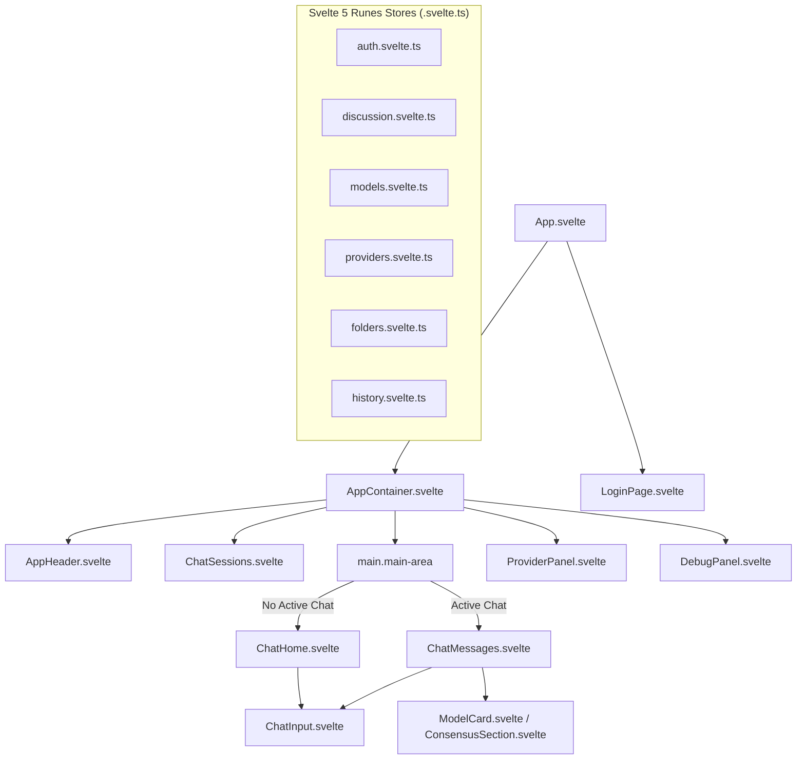

# Specification: Frontend Web Architecture

# Purpose
The frontend subsystem provides a responsive, high-performance web interface built with Svelte 5 and Vite. It allows users to manage AI provider credentials, discover models, configure discussion parameters, execute multi-model ensemble chats, and visualize consensus summaries.

# Responsibilities
- Render reactive user interfaces using Svelte 5 Runes (`$state`, `$derived`, `$effect`).
- Manage client-side session state, token rotation, and local encrypted secure storage.
- Dispatch parallel, staggered SSE streaming requests to the backend proxy API.
- Render rich markdown responses with code syntax highlighting, copy actions, and attachment previews.
- Support responsive viewport layouts across desktop, tablet, and mobile browsers.

# Architecture

# Data Flow
1. User actions trigger methods on Svelte 5 Runes stores (`discussion.start()`, `providers.load()`).
2. Stores invoke `frontend/src/lib/api/client.ts` fetch wrapper methods.
3. `client.ts` attaches JWT headers and resolves `getBaseUrl()` (handling same-origin web vs `https://ai-ensemble.samkhya.cloud` Capacitor native URL).
4. SSE stream events (`data: {"type": "delta", "content": "..."}`) update `$state` variables in `discussion.svelte.ts`, triggering immediate Svelte 5 DOM re-renders.

# Internal Components
- `AppContainer.svelte`: Root shell defining grid flexbox layout, header offset, and drawer states.
- `ChatInput.svelte`: Single-card bottom-docked composer with upward height drag handle, file attachment handler, advanced settings popover, and mobile auto-collapse.
- `ChatMessages.svelte`: Discussion thread container displaying turns, user messages, side-by-side model cards, and consensus sections.
- `discussion.svelte.ts`: Central state machine orchestrating turns, staggered SSE dispatches, stop commands, and transcript generation.
- `client.ts`: Unified API client handling request interceptors, 401 session isolation, and ReadableStream SSE parsing.

# Public Interfaces
- Mounting point: `#app` in `index.html`.
- Exported stores: `auth`, `discussion`, `providers`, `models`, `folders`, `history`, `theme`, `debug`, `nav`.

# Dependencies
- Svelte 5, Vite 6, TypeScript 5, Marked (markdown parser), DOMPurify (HTML sanitizer), PDF.js, Mammoth (DOCX parser), XLSX, Zip.js.

# Configuration
- `frontend/package.json`: Node dependencies & build scripts (`dev`, `build`, `check`, `test`).
- `frontend/tsconfig.json`: TypeScript compiler options.
- `frontend/src/vite-env.d.ts`: Vite environment type declarations.

# Current Behaviour
The frontend operates as a SPA. On mount, `App.svelte` initializes theme, verifies auth status, restores discussion state from local cache, and loads provider credentials.

# Constraints
- Svelte 5 Runes require Svelte compiler version 5.19+.
- Long model streams require browser support for `ReadableStream` and `TextDecoder`.

# Future Considerations
- Web Workers for offline document parsing and text embeddings.
- Virtualized list rendering for long discussion histories with 100+ turns.

# Related Specs
- [Architecture Spec](architecture.md)
- [Homepage Spec](homepage.md)
- [Prompt Composer Spec](prompt-composer.md)
- [Chat Spec](chat.md)
