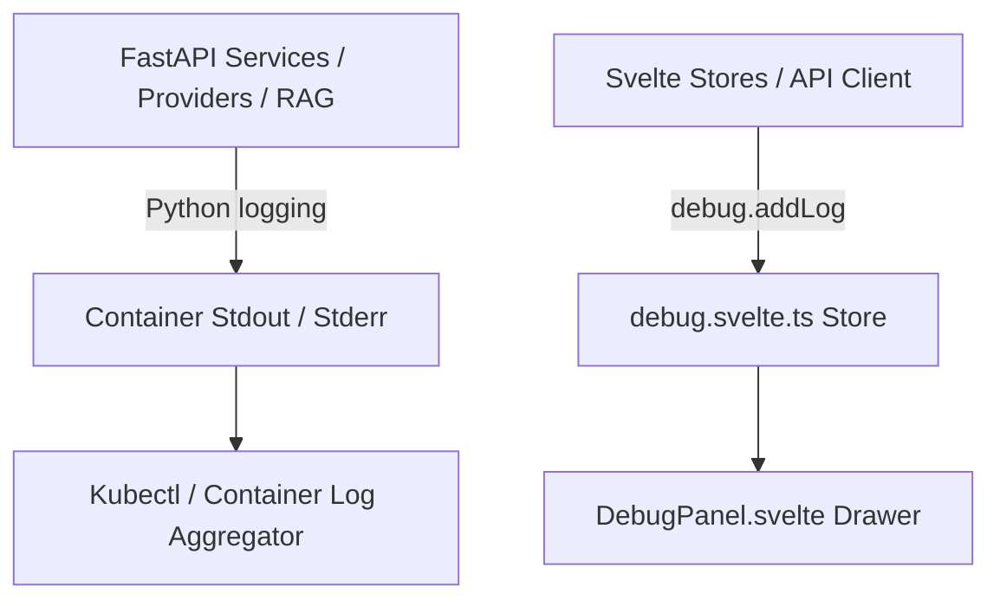

# Specification: Logging & Audit Telemetry

# Purpose
The Logging subsystem specifies structured python backend logging, RAG query debugging, SSE stream event tracing, and client-side real-time debug logging.

# Responsibilities
- Configure backend Python logging with timestamps, log levels, and module names.
- Log RAG retrieval events, domain classifier scores, and Trafilatura content extraction statuses (`ai_ensemble.rag` logger set to `DEBUG`).
- Capture client-side API events, token errors, and crypto operations in `debug.svelte.ts` store.
- Render in-memory event logs inside `DebugPanel.svelte`.

# Architecture

# Log Levels & Logger Categories

| Subsystem | Logger Name | Default Level | Sample Log Message |
| :--- | :--- | :--- | :--- |
| **Backend Main** | `uvicorn`, `app.main` | `INFO` | `2026-07-31 10:15:00 [INFO] app.main: Startup database initialized` |
| **RAG Engine** | `ai_ensemble.rag` | `DEBUG` | `2026-07-31 10:15:02 [DEBUG] ai_ensemble.rag: Domain classifier matched tech score=3.5` |
| **Provider Router** | `app.services.providers` | `INFO` | `2026-07-31 10:15:05 [INFO] providers.factory: Client initialized for provider openrouter` |
| **Frontend Store** | `debug.svelte.ts` | `INFO` | `[ai-ensemble] Created discussion 1` |

# Data Flow
1. Backend log events format using `%(asctime)s [%(levelname)s] %(name)s: %(message)s` and stream to `stdout`.
2. Frontend events call `debug.addLog(category, message, details)`.
3. Up to 200 frontend entries are held in memory for inspection via `DebugPanel.svelte`.

# Internal Components
- `backend/app/main.py`: `logging.basicConfig()` setup.
- `frontend/src/lib/stores/debug.svelte.ts`: Client-side log store.
- `frontend/src/lib/components/DebugPanel.svelte`: UI log viewer.

# Public Interfaces
- Client API: `debug.addLog(category: string, message: string, details?: any)`

# Dependencies
- Python standard library `logging` module, Svelte 5 Runes.

# Configuration
- Log level format: `%(asctime)s [%(levelname)s] %(name)s: %(message)s`.

# Current Behaviour
Backend logs are emitted to container `stdout` readable via `kubectl logs -n ai-ensemble deployment/ai-ensemble`. Frontend logs populate the Debug Panel.

# Constraints
- Sensitive plain-text passwords and unencrypted API keys MUST NEVER be written to logs.

# Future Considerations
- Centralized Loki/Grafana log aggregation for Kubernetes cluster containers.

# Related Specs
- [Backend Spec](backend.md)
- [Notifications Spec](notifications.md)
- [Security Spec](security.md)
