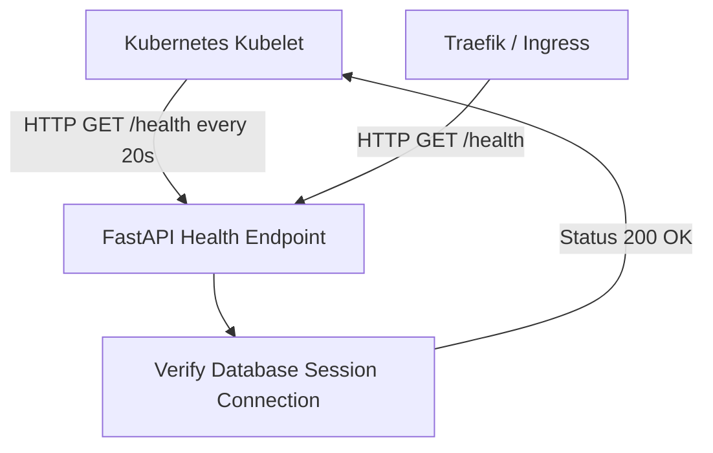

# Specification: Monitoring & Health Observability

# Purpose
The Monitoring subsystem specifies health check endpoints, HTTP probe readiness/liveness checks, rate limit telemetry, and system availability verification.

# Responsibilities
- Serve GET `/health` endpoint returning `{"status": "ok"}` for load balancers and Kubernetes probes.
- Configure Kubernetes liveness and readiness HTTP probes on backend pods.
- Monitor rate limiting metrics via SlowAPI.
- Provide connection health checks for configured AI provider API keys.

# Architecture

# Probe Specifications (`deployment.yaml`)

| Probe Type | Endpoint | Initial Delay | Period | Timeout | Failure Threshold |
| :--- | :--- | :--- | :--- | :--- | :--- |
| **Liveness Probe** | `GET /health` | 20s | 20s | 5s | 5 |
| **Readiness Probe** | `GET /health` | 10s | 10s | 5s | 6 |

# Data Flow
1. Kubelet sends `GET /health` to backend pod on port 8080.
2. Endpoint executes under rate limit constraint (`60/minute`).
3. Returns `{"status": "ok"}` with HTTP 200 OK status code.

# Internal Components
- `app/main.py`: `health()` endpoint route handler.
- `app/core/limiter.py`: SlowAPI rate limiter.

# Public Interfaces
- Endpoint: `GET /health`
- Response: `{"status": "ok"}` (HTTP 200 OK)

# Dependencies
- `FastAPI`, `SlowAPI`.

# Configuration
- Health check rate limit: `60/minute`.

# Current Behaviour
The health endpoint is live and verified (`curl -s https://ai-ensemble.samkhya.cloud/health` returns `{"status": "ok"}`).

# Constraints
- Health endpoint must respond in under 500ms to avoid probe timeouts.

# Future Considerations
- Prometheus metrics endpoint (`/metrics`) exposing request latencies, token consumption, and model error counts.

# Related Specs
- [Backend Spec](backend.md)
- [Deployment Spec](deployment.md)
