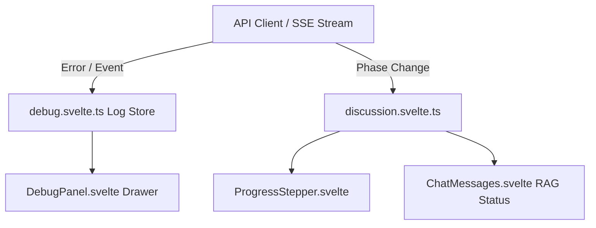

# Specification: Notifications & Real-Time Debug Panel

# Purpose
The Notifications subsystem handles real-time user feedback, progress steppers, toast notifications, error banners, and real-time execution event logging via `DebugPanel.svelte`.

# Responsibilities
- Display real-time execution step indicators (`ProgressStepper.svelte`) showing phases: `searching`, `routing`, `streaming`, `consensus`, `complete`.
- Render RAG context status badges (`RAG: 12 KB context retrieved` or `Searching the web...`).
- Provide non-intrusive toast alert messages for API errors, connection issues, and vision model warnings.
- Maintain a real-time event log in `debug.svelte.ts` displayed inside `DebugPanel.svelte` for auditing API streams and encryption migrations.

# Architecture

# Data Flow
1. Events in `client.ts` or `discussion.svelte.ts` log structured entries to `debug.addLog(category, message, details)`.
2. `DebugPanel.svelte` subscribes to `debug.logs` and renders a collapsible bottom-right log panel.
3. Errors (e.g. vision model mismatch warning when attaching images to DeepSeek text-only models) render inline warning banners in `ChatInput.svelte`.

# Internal Components
- `debug.svelte.ts`: Svelte 5 Runes store keeping up to 200 in-memory log entries.
- `DebugPanel.svelte`: Collapsible drawer displaying timestamped logs with copy-to-clipboard functionality.
- `ProgressStepper.svelte`: Step progression component rendering animated pulse dots.

# Public Interfaces
- Store: `debug.logs`, `debug.addLog(category, message, details)`, `debug.clear()`.

# Dependencies
- Svelte 5 Runes (`$state`, `$derived`), `Icon.svelte`.

# Configuration
- Log retention limit: 200 items in memory.

# Current Behaviour
Events during discussion turns (RAG search starting, provider client selection, SSE delta receipt, Fernet decryption) log entry records. Users can open the Debug Panel via bottom right toggle to view technical details.

# Constraints
- Logs are stored in volatile memory and cleared upon page reload.

# Future Considerations
- Export debug log trace as JSON file for troubleshooting support tickets.

# Related Specs
- [Frontend Spec](frontend.md)
- [Chat Spec](chat.md)
- [Logging Spec](logging.md)
