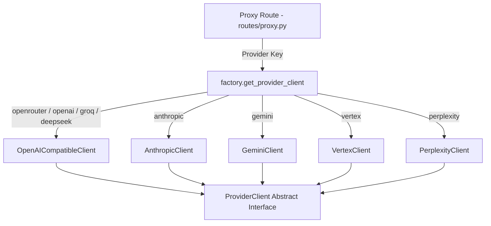

# Specification: Provider Routing & Client Factory

# Purpose
The Routing subsystem handles request routing, provider client instantiation, payload transformation, and URL canonicalization across heterogeneous LLM API contracts.

# Responsibilities
- Instantiate concrete `ProviderClient` instances via `factory.py` based on provider key aliases.
- Canonicalize user-entered endpoint URLs to standardized completion routes via `endpoints.py`.
- Transform internal `ChatRequest` DTOs into provider-specific request body formats (e.g. OpenAI `/v1/chat/completions`, Anthropic `/v1/messages`, Gemini `/v1beta/models/{model}:generateContent`).
- Handle multimodal base64 image payload formatting per provider API specification.

# Architecture



# Abstract Client Interface (`base.py`)

```python
class ProviderClient(ABC):
    @abstractmethod
    async def list_models(self) -> list[str]: ...

    @abstractmethod
    async def chat(self, request: ChatRequest) -> ChatResponse: ...

    @abstractmethod
    async def chat_stream(
        self, request: ChatRequest
    ) -> AsyncGenerator[StreamEvent, None]: ...
```

# Provider Implementation Mapping (`factory.py`)

| Provider Key Prefix | Client Class | API Contract Standard |
| :--- | :--- | :--- |
| `openrouter`, `openai`, `azure`, `groq`, `together`, `mistral`, `deepseek`, `xai`, `fireworks`, `ollama`, `openwebui`, `mammouth`, `requesty`, `nvidia` | `OpenAICompatibleClient` | OpenAI `/v1/chat/completions` REST/SSE |
| `anthropic` | `AnthropicClient` | Anthropic `/v1/messages` REST/SSE |
| `gemini` | `GeminiClient` | Google AI Studio `generateContent` / `streamGenerateContent` |
| `vertex` | `VertexClient` | GCP Vertex AI Regional REST & Claude on Vertex |
| `perplexity` | `PerplexityClient` | Perplexity `/v1/chat/completions` & `/v1/agent` |

# Data Flow
1. `routes/proxy.py` extracts `provider_key` from model string (`providerKey::modelId`).
2. `get_provider_client(credential)` builds client with decrypted API key and normalized endpoint URL.
3. Client transforms request messages into native provider format and executes HTTP call.

# Internal Components
- `backend/app/services/providers/factory.py`: Client instantiation factory.
- `backend/app/services/providers/endpoints.py`: URL canonicalization rules.
- `backend/app/services/providers/openai_compatible.py`: Generic OpenAI-compatible client.
- `backend/app/services/providers/anthropic.py`: Anthropic native client.
- `backend/app/services/providers/gemini.py`: Google Gemini native client.

# Public Interfaces
- Python Factory Function: `get_provider_client(credential: ProviderCredential) -> ProviderClient`

# Dependencies
- `httpx` (async HTTP client), `google-auth` (GCP service account tokens).

# Configuration
- Timeout override per request.

# Current Behaviour
The factory inspects provider key prefixes and returns the appropriate client instance. Custom OpenAI-compatible endpoints seamlessly reuse `OpenAICompatibleClient`.

# Constraints
- Provider API keys are decrypted in memory only for the duration of the request.

# Future Considerations
- Automatic fallback routing to secondary provider endpoints on 5xx server errors.

# Related Specs
- [Backend Spec](backend.md)
- [Providers Spec](providers.md)
- [Streaming Spec](streaming.md)
