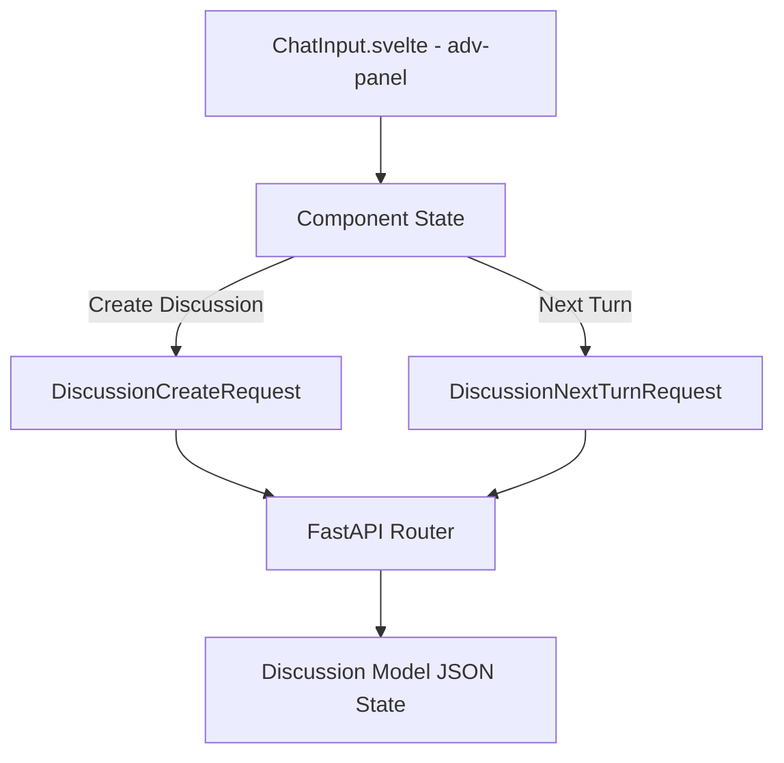

# Specification: Execution Settings & Formats

# Purpose
The Settings subsystem specifies user-configurable discussion execution parameters, model formats, prompt presets, response timeouts, token limits, RAG retrieval modes, and Deep Research toggles.

# Responsibilities
- Provide pre-configured prompt format presets ("Compact", "Elaborate", "Custom", "None") for individual model answers and consensus summaries.
- Allow configuration of consensus synthesis status, custom consensus model selection, and discussion pass count (1, 2, or 3 rounds).
- Manage response timeout (10s–300s) and maximum token limit (500–16,000 tokens) per model call.
- Toggle RAG retrieval mode (`model-self` with web search context vs `model-only` raw LLM generation).
- Toggle Deep Research web search passes between discussion rounds.

# Architecture
Discussion execution settings are configured inside the `adv-panel` popover sheet in `ChatInput.svelte` and attached to `DiscussionCreateRequest` / `DiscussionNextTurnRequest` API payloads sent to the backend.

# Preset Definitions

| Preset Name | Target | Pre-configured Instruction Text |
| :--- | :--- | :--- |
| **Compact (Default Summary)** | Consensus Summary | *"Simply get information from all responses. Do not add any more information from your side or elsewhere. analyze all the responses, get the common points and the not common points and share in very short precise format a best consensus. No additional explanations."* |
| **Elaborate** | Model Response / Summary | *"Provide an elaborate synthesis: a full structured write-up covering each model's position, points of consensus, and remaining disagreements."* |
| **None** | Model Response / Summary | `""` (Empty string, no format instructions appended). |
| **Custom** | Model Response / Summary | User-defined custom format instruction string. |

# Data Flow
1. User toggles `showAdvanced` in `ChatInput.svelte` to open the popover sheet.
2. Changing preset dropdown auto-fills the editable `responseFormatText` or `summaryFormatText` textareas.
3. Upon sending, settings are transmitted to backend and persisted in `Discussion.state_json`.

# Internal Components
- `ChatInput.svelte`: Contains advanced configuration UI inputs.
- `discussion.svelte.ts`: Holds active discussion configuration state.
- `Discussion` ORM Model: Stores settings inside encrypted `state_json`.

# Public Interfaces
- Settings fields in API DTOs: `consensus_enabled`, `consensus_model`, `total_rounds`, `timeout`, `max_tokens`, `rag_mode`, `deep_research`, `response_format`, `response_format_text`, `summary_format`, `summary_format_text`, `summary_instructions`.

# Dependencies
- `discussion.svelte.ts`, `ChatInput.svelte`, `schemas/discussion.py`.

# Configuration
- Default Timeout: `120` seconds.
- Default Max Tokens: `6000` tokens.
- Default RAG Mode: `"model-only"` (or `"model-self"` when context search is active).

# Current Behaviour
Settings are remembered across turns within an active discussion and saved to local state.

# Constraints
- Timeout is constrained between 10s and 300s. Max tokens is constrained between 500 and 16,000.

# Future Considerations
- Global user defaults saved in user profile settings table.

# Related Specs
- [Prompt Composer Spec](prompt-composer.md)
- [Ensemble Spec](ensemble.md)
