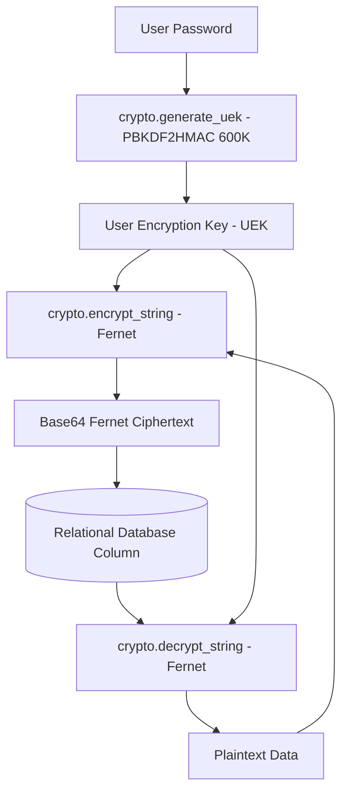

# Specification: Data Persistence & Encrypted Storage

# Purpose
The Storage subsystem specifies zero-knowledge payload data persistence, field-level encryption at rest, encryption key derivation, and session store persistence.

# Responsibilities
- Encrypt user prompts, discussion titles, model response contents, retrieved RAG contexts, provider API keys, and search history queries at rest.
- Provide zero-knowledge key security where database ciphertexts cannot be read without the user's derived User Encryption Key (UEK).
- Support mobile Android native session persistence via `SessionStore` ORM table.
- Provide backward compatibility shims for legacy unencrypted records.

# Architecture

# Encrypted Database Columns

| Table | Encrypted Column Name | Plaintext Content |
| :--- | :--- | :--- |
| `users` | `master_key_encrypted` | Encrypted envelope key |
| `provider_credentials` | `api_key_encrypted` | Provider API Key |
| `provider_credentials` | `adc_json_encrypted` | GCP Service Account ADC JSON |
| `discussions` | `title_encrypted` | Discussion title |
| `discussions` | `question_encrypted` | User prompt question |
| `discussions` | `retrieved_context_encrypted` | RAG web search context |
| `messages` | `content_encrypted` | Model response output |
| `search_history` | `query_encrypted` | Search query |

# Data Flow
1. User logs in; backend derives 32-byte UEK from password and user's salt.
2. In-memory UEK is passed to `crypto.encrypt_string(text, uek)` before executing SQLAlchemy `db.add()`.
3. When querying records, `crypto.decrypt_string(ciphertext, uek)` decrypts fields on the fly before returning JSON DTOs to the client.

# Internal Components
- `app/core/crypto.py`: Cipher functions (`encrypt_string`, `decrypt_string`, `generate_uek`, `get_fernet`).
- `app/core/sessions.py`: `SessionStore` session token management.

# Public Interfaces
- Module Functions:
  - `crypto.encrypt_string(data: str, uek: str) -> str`
  - `crypto.decrypt_string(data: str, uek: str) -> str`

# Dependencies
- `cryptography` (Fernet symmetric encryption), `PBKDF2HMAC`.

# Configuration
- `CREDENTIAL_ENCRYPTION_KEY`: Server fallback key used for encrypting mobile session store tokens.

# Current Behaviour
All sensitive user payload fields are saved as Fernet ciphertexts in the database.

# Constraints
- If a user loses their password, encrypted data cannot be recovered without an offline backup of their UEK.

# Future Considerations
- User-managed recovery key export/import for account recovery.

# Related Specs
- [Backend Spec](backend.md)
- [Authentication Spec](authentication.md)
- [Database Spec](database.md)
