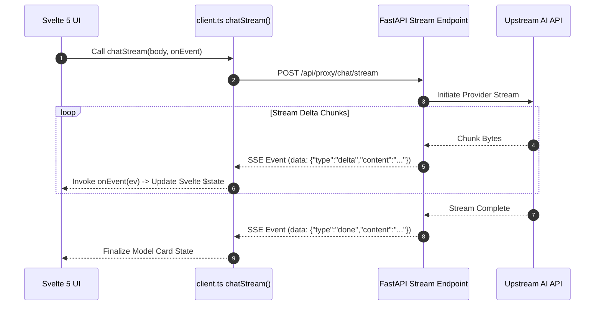

# Specification: SSE Streaming & Event Protocol

# Purpose
The Streaming subsystem specifies Server-Sent Events (SSE) protocol formats, event parsing, chunk buffering, client-side ReadableStream consumption, and reconnection handling for real-time model completions.

# Responsibilities
- Stream completion deltas from backend proxy (`/api/proxy/chat/stream`) to frontend clients over HTTP SSE.
- Buffer text chunks and emit structured JSON stream events.
- Handle stream completion (`done`), error events, and keep-alive signals.
- Isolate upstream provider streaming errors so they do not invalidate the user's platform authentication session.

# Architecture



# SSE Event Schema (`StreamEvent`)

```typescript
export type StreamEvent =
  | { type: "delta"; content: string }
  | { type: "done"; content?: string; stats?: { outputTokens?: number; durationMs?: number } }
  | { type: "error"; error: string }
  | { type: "phase"; phase: "searching" | "routing" | "streaming" | "consensus" };
```

# Data Flow
1. `client.ts` issues `fetch("/api/proxy/chat/stream")` and obtains `resp.body.getReader()`.
2. `TextDecoder` decodes incoming stream bytes into text lines.
3. Lines starting with `data:` are stripped and parsed as `StreamEvent` JSON objects.
4. `onEvent(ev)` updates `discussion.data.rounds[rn][modelKey]` in real time.

# Internal Components
- `app/api/routes/proxy.py`: FastAPI endpoint returning `EventSourceResponse` or `StreamingResponse`.
- `frontend/src/lib/api/client.ts`: `chatStream()` method consuming `ReadableStream`.

# Public Interfaces
- Endpoint: `POST /api/proxy/chat/stream`
- Header: `Accept: text/event-stream`

# Dependencies
- `httpx` async byte iterator in Python backend.
- `ReadableStream` and `TextDecoder` in browser / WebView.

# Configuration
- Chunk buffer size: 1024 bytes.

# Current Behaviour
Deltas render character-by-character into Svelte 5 model cards with smooth scrolling.

# Constraints
- Upstream 401 errors during streaming throw an `ApiError("Provider authorization failed")` without revoking the user's platform access token.

# Future Considerations
- WebSockets fallback for environments with aggressive HTTP proxy SSE buffering.

# Related Specs
- [Backend Spec](backend.md)
- [Ensemble Spec](ensemble.md)
- [WebSocket Spec](websocket.md)
