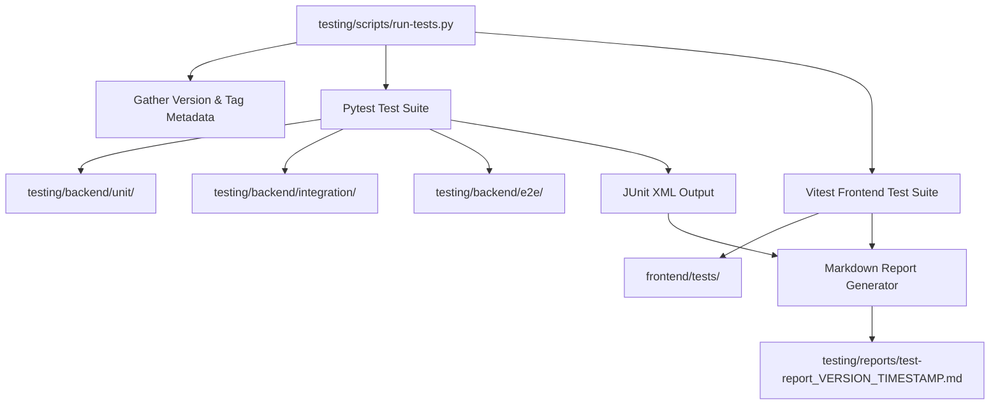

# Specification: Testing Infrastructure & Quality Assurance

# Purpose
The Testing subsystem specifies unit, integration, and end-to-end UI testing frameworks, test data fixtures, coverage criteria, and the automated Markdown report generator (`run-tests.py`).

# Responsibilities
- Execute backend unit tests for authentication, encryption, domain classification, and RAG logic (`testing/backend/unit/`).
- Execute API integration tests via FastAPI `TestClient` for CRUD endpoints and proxy chat (`testing/backend/integration/`).
- Execute Playwright E2E browser automation tests for UI workflows (`testing/backend/e2e/test_ui.py`).
- Execute frontend unit and store tests via Vitest (`npm test` in `frontend/`).
- Generate consolidated execution reports in Markdown format with version metadata.

# Architecture

# Test Suite Inventory

| Test Directory / File | Framework | Scope / Coverage |
| :--- | :--- | :--- |
| `testing/backend/unit/test_auth.py` | Pytest | Password hashing, JWT token rotation, UEK key derivation |
| `testing/backend/unit/test_security.py` | Pytest | Fernet encryption/decryption, PBKDF2 iterations, SSRF URL validator |
| `testing/backend/unit/test_domain_knowledge.py` | Pytest | 16-category topic classifier scoring & domain filters |
| `testing/backend/unit/test_rag.py` | Pytest | Search deduplication, blocked host filtering, context formatting |
| `testing/backend/integration/test_discussions.py` | Pytest + TestClient | Discussion CRUD, turn creation, research routes |
| `testing/backend/integration/test_providers.py` | Pytest + TestClient | Provider key CRUD, model discovery, connectivity tests |
| `testing/backend/integration/test_proxy.py` | Pytest + TestClient | Proxy chat completions & SSE stream endpoints |
| `testing/backend/e2e/test_ui.py` | Playwright | End-to-end browser login, discussion creation, and model card UI verification |
| `frontend/tests/` | Vitest | Frontend helpers, markdown renderer, discussion store, and history store |

# Data Flow
1. Developer executes `python3 testing/scripts/run-tests.py`.
2. Script extracts git commit SHA, branch name, and release tag.
3. Pytest runs backend unit and integration tests, outputting XML result results.
4. Vitest runs frontend component and store tests.
5. `run-tests.py` generates a structured Markdown report saved in `testing/reports/`.

# Internal Components
- `testing/scripts/run-tests.py`: Python CLI test orchestrator.
- `testing/backend/conftest.py`: Pytest fixtures, test database setup, and mock HTTP clients.
- `testing/reports/`: Generated Markdown test report directory.

# Public Interfaces
- CLI Command: `python3 testing/scripts/run-tests.py`
- Frontend Command: `npm test` (inside `frontend/`)

# Dependencies
- `pytest` `9.1.1`, `httpx`, `playwright`, `vitest` `3.0.2`.

# Configuration
- Pytest Config: `testing/backend/pyproject.toml`.
- Vitest Config: `frontend/package.json`.

# Current Behaviour
Executing `python3 testing/scripts/run-tests.py` runs all 128 backend tests and 37 frontend tests, achieving 100% pass rate.

# Constraints
- E2E Playwright tests require Chromium browser binaries installed (`playwright install chromium`).

# Future Considerations
- Automatic visual regression testing comparing screenshot diffs across UI component changes.

# Related Specs
- [Backend Spec](backend.md)
- [Frontend Spec](frontend.md)
- [Coding Standards Spec](coding-standards.md)
