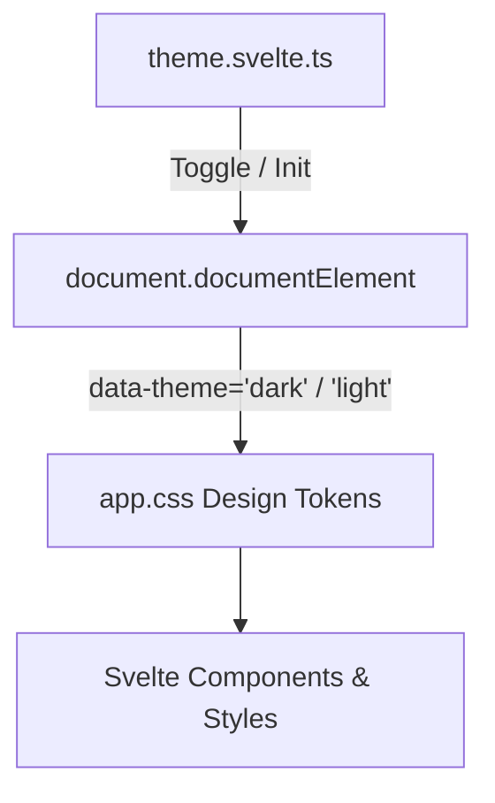

# Specification: Theme System & Styling Architecture

# Purpose
The Theme subsystem defines the visual design tokens, dark/light theme switching, CSS custom properties, responsive breakpoints, accessible focus states, and print/PDF export styles for AI-Ensemble.

# Responsibilities
- Manage global CSS custom variables (`--bg-primary`, `--text-primary`, `--accent`, `--border`, etc.).
- Persist user theme preference in local storage and apply `data-theme="light"` or `data-theme="dark"` attribute to `document.documentElement`.
- Enforce accessible focus rings (`:focus-visible`) and high-contrast text ratios.
- Provide custom print styles (`@media print`) for clean single-column PDF chat transcript exports.

# Architecture

# Design Tokens (`app.css`)

| Token | Dark Theme Default | Light Theme Default | Usage |
| :--- | :--- | :--- | :--- |
| `--bg-primary` | `#000000` | `#fafafa` | Primary page background |
| `--bg-secondary` | `#0a0a0c` | `#ffffff` | Header, sidebar, and card background |
| `--bg-tertiary` | `#121214` | `#f4f4f5` | User message bubbles and button backgrounds |
| `--text-primary` | `#f5f5f7` | `#09090b` | Main headings and body text |
| `--text-secondary` | `#a1a1aa` | `#52525b` | Secondary labels and subtitles |
| `--text-tertiary` | `#71717a` | `#71717a` | Muted text and disabled states |
| `--accent` | `#ff5c00` | `#ff5c00` | Primary brand orange, active borders, and focus rings |
| `--border` | `#1f1f23` | `#e4e4e7` | Standard card and layout borders |
| `--input-bg` | `#16161a` | `#ffffff` | Input controls and chatbox background |
| `--input-border` | `#1f1f23` | `#e4e4e7` | Input border color |

# Data Flow
1. `theme.svelte.ts` initializes on app mount, checking `localStorage.getItem("aiEnsembleTheme")` or `prefers-color-scheme`.
2. Calling `theme.toggle()` toggles `data-theme` attribute on `<html>` and saves preference.

# Internal Components
- `theme.svelte.ts`: Svelte 5 Runes store managing theme state.
- `app.css`: Global CSS custom properties, resets, utility classes, and print media queries.

# Public Interfaces
- Store: `theme.theme` (`"dark"` | `"light"`), `theme.toggle()`, `theme.init()`.

# Dependencies
- Standard CSS Custom Properties (`var(...)`) natively supported by all modern browsers and WebViews.

# Configuration
- Theme storage key: `"aiEnsembleTheme"`.

# Current Behaviour
Dark theme is active by default (`:root`). Clicking the sun/moon icon in `AppHeader.svelte` toggles to light theme immediately without page reload.

# Constraints
- High-contrast rules must be preserved during PDF/print exports (forcing black text on white background).

# Future Considerations
- OLED True Black dark mode option and customizable accent color picker.

# Related Specs
- [Frontend Spec](frontend.md)
- [Homepage Spec](homepage.md)
