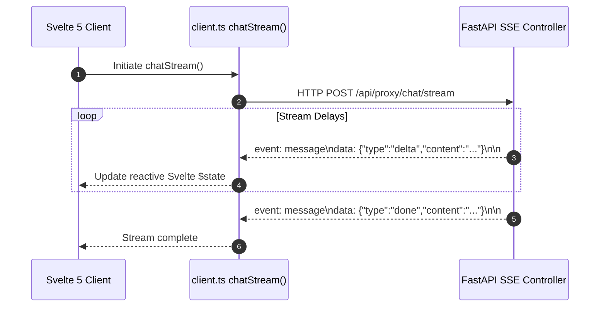

# Specification: SSE Streaming & WebSocket Transport Comparison

# Purpose
This specification documents the real-time transport architecture of AI-Ensemble, detailing why Server-Sent Events (SSE) over HTTP/2 was chosen over WebSockets, stream chunk formatting, and client reconnection logic.

# Responsibilities
- Define HTTP Server-Sent Events (`text/event-stream`) transport mechanics.
- Specify stream frame parsing, line buffering, and keep-alive heartbeats.
- Detail client-side stream reconnection, abort signal cancellation, and stream lifecycle hooks.

# Transport Comparison

| Feature | Server-Sent Events (Current Choice) | WebSockets |
| :--- | :--- | :--- |
| **Direction** | Unidirectional (Server -> Client) | Full-Duplex (Bidirectional) |
| **Protocol** | Standard HTTP/1.1 or HTTP/2 | `ws://` or `wss://` Upgrade Protocol |
| **Ingress Compatibility** | Excellent (Native Trafeik / Nginx support) | Requires special upgrade proxy headers |
| **Auth Headers** | Standard `Authorization: Bearer` HTTP headers | Query parameters or ticket exchange |
| **Multiplexing** | Native HTTP/2 stream multiplexing | Requires custom framing |

# Architecture

# Data Flow
1. Client initiates HTTP POST with `Accept: text/event-stream`.
2. Backend returns `StreamingResponse` yielding string blocks formatted as `data: <JSON>\n\n`.
3. Client `TextDecoder` parses line chunks, stripping `data:` prefixes and deserializing `StreamEvent` JSON objects.

# Internal Components
- `app/api/routes/proxy.py`: SSE controller using `StreamingResponse`.
- `client.ts`: `chatStream()` reader.

# Public Interfaces
- Content-Type: `text/event-stream`
- Event format: `data: {"type": "delta"|"done"|"error"|"phase", ...}\n\n`

# Dependencies
- Standard Fetch API `ReadableStream` in browsers and Capacitor WebViews.

# Configuration
- Streaming chunk size: 1024 bytes.

# Current Behaviour
Deltas stream smoothly over standard HTTP POST requests without requiring WebSocket handshake upgrades.

# Constraints
- HTTP/1.1 connections limit concurrent SSE streams per browser domain to 6 (HTTP/2 removes this limit).

# Future Considerations
- Adding WebSocket support if bidirectional audio/voice streaming is introduced.

# Related Specs
- [Streaming Spec](streaming.md)
- [API Spec](api.md)
